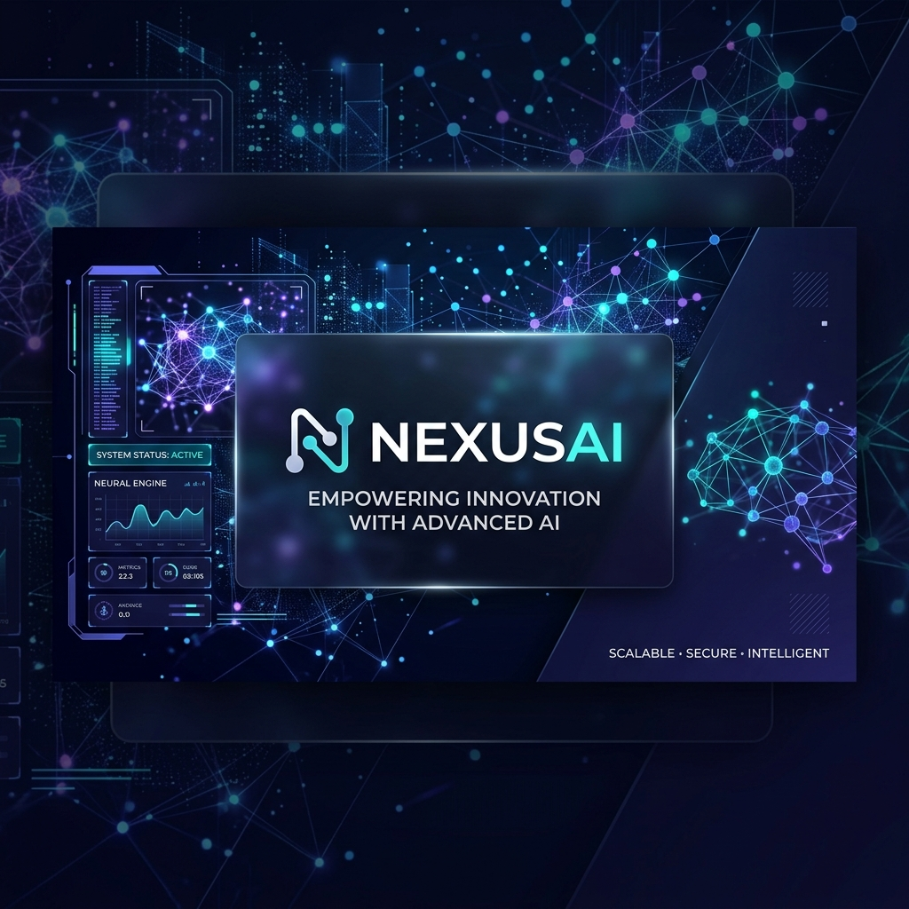
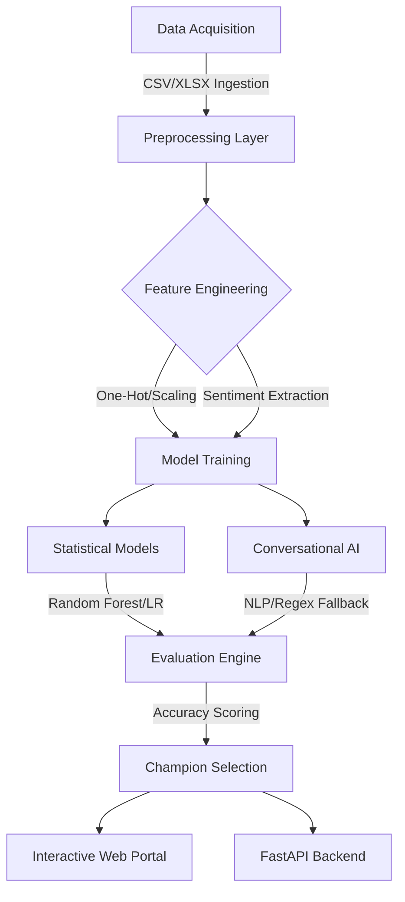

<p align="center">
  
</p>

# 🚀 NexusAI Pro Suite: Advanced Conversational AI & Market Analytics

[](https://www.python.org/)
[](https://github.com/NexusAI)
[](#key-features)
[](LICENSE)

**NexusAI Pro Suite** is a high-performance framework designed to unify the power of predictive analytics and intelligent conversational agents. By blending classical statistical rigor with state-of-the-art Natural Language Processing (NLP), this project provides a seamless ecosystem for both customer retention and interactive AI assistance.

---

## 📽️ Project Overview
The platform automates the entire AI/ML lifecycle: from multi-source data ingestion (CSV/XLSX) and feature engineering to model deployment and interactive glassmorphism visualization.

### 📊 The Intelligence Ecosystem
The suite provides dedicated interfaces for conversational AI and predictive churn analysis, both powered by high-performance scikit-learn backends.

---

## 🛠️ Architecture & Workflow



---

## ✨ Key Features
- **Multi-Model Intelligence**: Simultaneously handles **Random Forest** for churn forecasting and **Naive Bayes** for intent classification.
- **Sentiment-Driven Insights**: Integrates real-time lexicon analysis to capture the "human" emotion behind customer interactions.
- **Contextual Memory**: Built-in persistence layer that allows the AI to remember and adapt to multi-turn conversation flows.
- **Enterprise Reporting**: Generates ready-to-use exports for Power BI and interactive HTML dashboards for business stakeholders.

---

## 🚦 Getting Started

### 1. Environment Setup
Clone the repository and initialize your workspace:
```bash
# Clone the repository
git clone https://github.com/NexusAI/pro-suite.git
cd nexus-ai-pro-suite

# Setup Virtual Environment
python -m venv .venv
source .venv/bin/activate  # Windows: .venv\Scripts\activate

# Install Dependencies
pip install -r backend/chatbot/requirements.txt
```

### 2. Execution Pipeline
Launch the master portal and start the backend engines:

| Task | Command | Location |
| :--- | :--- | :--- |
| **Master Portal** | Open `index.html` | Root Directory |
| **Chatbot Server** | `python server.py` | `backend/chatbot/` |
| **Churn API** | `python main.py` | `backend/churn/` |
| **Model Training** | `python train_model.py` | `backend/churn/` |

---

## 🏗️ Project Structure
```text
├── frontend/      # Unified UI: Chatbot and ChurnSight Dashboards
├── backend/       # AI Engines: FastAPI, ML Models, and Inference
├── data/          # Enterprise datasets (CSV, XLSX)
├── notebooks/     # Research: Jupyter Notebooks for EDA
├── powerbi/       # Reporting: PBIX Business Intelligence files
├── docs/          # Technical guides, images, and dev notes
└── README.md
```

---
*Developed for research and analytical purposes. Built with passion for the future of AI.*
